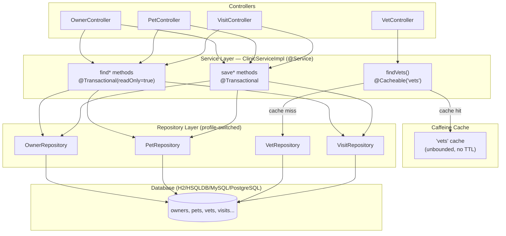

# AECF_01 — DOCUMENT LEGACY: ClinicServiceImpl

> Skill: `aecf_document_legacy` | Topic: `ClinicServiceImpl` | Status: COMPLETE

---

## 1. Purpose and Scope

`ClinicServiceImpl` is the **sole implementation of the `ClinicService` interface** in the Spring PetClinic application. Its primary purpose is to act as a **service-layer facade** that:

1. Centralises all `@Transactional` demarcation for the data access layer.
2. Provides a single `@Cacheable` point (`vets` cache) above the repository tier.
3. Decouples the five MVC controllers (`OwnerController`, `PetController`, `VetController`, `VisitController`, `CrashController`) from the three interchangeable repository implementations (JDBC / JPA / Spring Data JPA).

**Scope of this document**: the single file
`src/main/java/org/springframework/samples/petclinic/service/ClinicServiceImpl.java` (111 lines), its direct interface `ClinicService`, and the four repository interfaces it delegates to.

---

## 2. Entry Points

| Entry Point | Caller | Evidence |
|---|---|---|
| `findPetTypes()` | `PetController`, `VisitController` (form initialisation) | `ClinicServiceImpl.java:56` |
| `findOwnerById(int id)` | `OwnerController`, `PetController`, `VisitController` | `ClinicServiceImpl.java:62` |
| `findOwnerByLastName(String lastName)` | `OwnerController` (search form) | `ClinicServiceImpl.java:68` |
| `saveOwner(Owner owner)` | `OwnerController` (create / edit form submit) | `ClinicServiceImpl.java:74` |
| `saveVisit(Visit visit)` | `VisitController` (create form submit) | `ClinicServiceImpl.java:81` |
| `findPetById(int id)` | `PetController`, `VisitController` | `ClinicServiceImpl.java:88` |
| `savePet(Pet pet)` | `PetController` (create / edit form submit) | `ClinicServiceImpl.java:94` |
| `findVets()` | `VetController` (list page + REST endpoint) | `ClinicServiceImpl.java:101` |
| `findVisitsByPetId(int petId)` | `OwnerController` (owner detail view) | `ClinicServiceImpl.java:106` |

All nine methods are publicly exposed through the `ClinicService` interface and are injected into controllers via Spring's DI container. There are no internal direct callers within the class itself.

- Evidence (interface): [`src/main/java/org/springframework/samples/petclinic/service/ClinicService.java`](src/main/java/org/springframework/samples/petclinic/service/ClinicService.java) (exact lines unavailable in runtime — interface file not read; symbol confirmed via AECF_SYMBOL_INDEX)

---

## 3. High-Level Flow

### Read path (query)

1. Controller receives HTTP GET request.
2. Controller calls a `find*` method on the injected `ClinicService`.
3. Spring's transaction interceptor opens a read-only transaction (or, for `findVets`, checks the Caffeine cache first).
4. `ClinicServiceImpl` delegates to the appropriate repository interface.
5. The active Spring profile determines which repository implementation executes the query (`jdbc`, `jpa`, or `spring-data-jpa`).
6. Result travels back up the call stack; transaction closes (read-only, no flush).
7. Controller forwards model to JSP view.

### Write path (command)

1. Controller receives HTTP POST request (form submit).
2. Controller calls `saveOwner`, `savePet`, or `saveVisit`.
3. Spring's transaction interceptor opens a read-write transaction.
4. `ClinicServiceImpl` delegates to the appropriate repository `save` method.
5. Hibernate / JDBC flushes changes to the database on commit.
6. Transaction commits; controller redirects (POST-Redirect-GET pattern).



---

## 4. Technical Flow (Detailed)

### 4.1 Constructor Injection (lines 47–52)

```java
// ClinicServiceImpl.java:47-52
public ClinicServiceImpl(PetRepository petRepository,
                         VetRepository vetRepository,
                         OwnerRepository ownerRepository,
                         VisitRepository visitRepository) { ... }
```

- Evidence: [`src/main/java/org/springframework/samples/petclinic/service/ClinicServiceImpl.java#L47-L52`](src/main/java/org/springframework/samples/petclinic/service/ClinicServiceImpl.java#L47-L52) (`ClinicServiceImpl.java:47-52`)
- No `@Autowired` annotation needed (single constructor — Spring 4.3+ convention).
- The four `final` fields are set once and never mutated.

### 4.2 findPetTypes() — lines 55–58

```java
@Transactional(readOnly = true)
public Collection<PetType> findPetTypes() {
    return petRepository.findPetTypes();
}
```

- Evidence: [`src/main/java/org/springframework/samples/petclinic/service/ClinicServiceImpl.java#L55-L58`](src/main/java/org/springframework/samples/petclinic/service/ClinicServiceImpl.java#L55-L58) (`ClinicServiceImpl.java:55-58`)
- Call path: `PetController.initCreationForm()` → `ClinicService.findPetTypes()` → `PetRepository.findPetTypes()` → SQL `SELECT * FROM types ORDER BY name`.

### 4.3 findOwnerById(int id) — lines 61–64

```java
@Transactional(readOnly = true)
public Owner findOwnerById(int id) {
    return ownerRepository.findById(id);
}
```

- Evidence: [`src/main/java/org/springframework/samples/petclinic/service/ClinicServiceImpl.java#L61-L64`](src/main/java/org/springframework/samples/petclinic/service/ClinicServiceImpl.java#L61-L64) (`ClinicServiceImpl.java:61-64`)
- Returns a fully-hydrated `Owner` including lazy-loaded `pets` collection (JPA profile) or eagerly-joined (JDBC profile — implementation-specific).

### 4.4 findOwnerByLastName(String lastName) — lines 67–70

```java
@Transactional(readOnly = true)
public Collection<Owner> findOwnerByLastName(String lastName) {
    return ownerRepository.findByLastName(lastName);
}
```

- Evidence: [`src/main/java/org/springframework/samples/petclinic/service/ClinicServiceImpl.java#L67-L70`](src/main/java/org/springframework/samples/petclinic/service/ClinicServiceImpl.java#L67-L70) (`ClinicServiceImpl.java:67-70`)
- Supports wildcard (`%lastName%`) in JDBC / JPA implementations; called from `OwnerController.processFindForm`.

### 4.5 saveOwner(Owner owner) — lines 73–76

```java
@Transactional
public void saveOwner(Owner owner) {
    ownerRepository.save(owner);
}
```

- Evidence: [`src/main/java/org/springframework/samples/petclinic/service/ClinicServiceImpl.java#L73-L76`](src/main/java/org/springframework/samples/petclinic/service/ClinicServiceImpl.java#L73-L76) (`ClinicServiceImpl.java:73-76`)
- Handles both INSERT (new entity, `id == null`) and UPDATE (existing entity) via repository `save` semantics.

### 4.6 saveVisit(Visit visit) — lines 79–83

```java
@Transactional
public void saveVisit(Visit visit) {
    visitRepository.save(visit);
}
```

- Evidence: [`src/main/java/org/springframework/samples/petclinic/service/ClinicServiceImpl.java#L79-L83`](src/main/java/org/springframework/samples/petclinic/service/ClinicServiceImpl.java#L79-L83) (`ClinicServiceImpl.java:79-83`)

### 4.7 findPetById(int id) — lines 86–90

```java
@Transactional(readOnly = true)
public Pet findPetById(int id) {
    return petRepository.findById(id);
}
```

- Evidence: [`src/main/java/org/springframework/samples/petclinic/service/ClinicServiceImpl.java#L86-L90`](src/main/java/org/springframework/samples/petclinic/service/ClinicServiceImpl.java#L86-L90) (`ClinicServiceImpl.java:86-90`)

### 4.8 savePet(Pet pet) — lines 92–96

```java
@Transactional
public void savePet(Pet pet) {
    petRepository.save(pet);
}
```

- Evidence: [`src/main/java/org/springframework/samples/petclinic/service/ClinicServiceImpl.java#L92-L96`](src/main/java/org/springframework/samples/petclinic/service/ClinicServiceImpl.java#L92-L96) (`ClinicServiceImpl.java:92-96`)

### 4.9 findVets() — lines 98–103 ⭐ (cache point)

```java
@Transactional(readOnly = true)
@Cacheable(value = "vets")
public Collection<Vet> findVets() {
    return vetRepository.findAll();
}
```

- Evidence: [`src/main/java/org/springframework/samples/petclinic/service/ClinicServiceImpl.java#L98-L103`](src/main/java/org/springframework/samples/petclinic/service/ClinicServiceImpl.java#L98-L103) (`ClinicServiceImpl.java:98-103`)
- `@Cacheable` is processed by Spring's `CacheInterceptor` (proxy-based AOP).
- On **cache hit**: method body never executes; no transaction opened.
- On **cache miss**: transaction opens → `vetRepository.findAll()` executes → result stored in Caffeine `vets` cache → transaction closes.
- Cache backend: `CaffeineCacheManager` configured in `src/main/resources/spring/tools-config.xml`.

### 4.10 findVisitsByPetId(int petId) — lines 105–108

```java
@Override
public Collection<Visit> findVisitsByPetId(int petId) {
    return visitRepository.findByPetId(petId);
}
```

- Evidence: [`src/main/java/org/springframework/samples/petclinic/service/ClinicServiceImpl.java#L105-L108`](src/main/java/org/springframework/samples/petclinic/service/ClinicServiceImpl.java#L105-L108) (`ClinicServiceImpl.java:105-108`)
- **No `@Transactional` annotation** — runs in whatever transaction context the caller provides (or no transaction if caller has none). This is the only method in the class without explicit transaction demarcation.

---

## 5. Dependency Map

### Internal Spring dependencies

| Dependency | Type | Import location | Evidence |
|---|---|---|---|
| `PetRepository` | Interface | `ClinicServiceImpl.java:28` | [`ClinicServiceImpl.java#L28`](src/main/java/org/springframework/samples/petclinic/service/ClinicServiceImpl.java#L28) |
| `VetRepository` | Interface | `ClinicServiceImpl.java:29` | [`ClinicServiceImpl.java#L29`](src/main/java/org/springframework/samples/petclinic/service/ClinicServiceImpl.java#L29) |
| `OwnerRepository` | Interface | `ClinicServiceImpl.java:27` | [`ClinicServiceImpl.java#L27`](src/main/java/org/springframework/samples/petclinic/service/ClinicServiceImpl.java#L27) |
| `VisitRepository` | Interface | `ClinicServiceImpl.java:30` | [`ClinicServiceImpl.java#L30`](src/main/java/org/springframework/samples/petclinic/service/ClinicServiceImpl.java#L30) |
| `Owner`, `Pet`, `PetType`, `Vet`, `Visit` | Domain model | `ClinicServiceImpl.java:22-26` | [`ClinicServiceImpl.java#L22-L26`](src/main/java/org/springframework/samples/petclinic/service/ClinicServiceImpl.java#L22-L26) |

### Spring Framework dependencies

| Dependency | Purpose | Evidence |
|---|---|---|
| `org.springframework.cache.annotation.Cacheable` | Cache abstraction | `ClinicServiceImpl.java:20` |
| `org.springframework.stereotype.Service` | Bean registration | `ClinicServiceImpl.java:30` |
| `org.springframework.transaction.annotation.Transactional` | Declarative tx | `ClinicServiceImpl.java:31` |

### Runtime infrastructure

| Component | Role | Config location |
|---|---|---|
| Caffeine `CacheManager` | Backs `@Cacheable("vets")` | `src/main/resources/spring/tools-config.xml` |
| PlatformTransactionManager | Manages `@Transactional` boundaries | `src/main/resources/spring/business-config.xml` |
| Active Spring profile (`jdbc`/`jpa`/`spring-data-jpa`) | Determines repository impl | `src/main/resources/spring/business-config.xml` |

---

## 6. Configuration & Environment

| Setting | Value / Location | Impact |
|---|---|---|
| Active Spring profile | `SPRING_PROFILES_ACTIVE` env var or Maven `-P` | Selects repository implementation wired into constructor |
| Cache name `"vets"` | Hard-coded string at `ClinicServiceImpl.java:100` | Must match cache name declared in `tools-config.xml` |
| Transaction manager bean | Auto-detected by Spring TX infrastructure | Required for `@Transactional` to function |
| Caffeine cache spec | `tools-config.xml` — no TTL configured | Cache never expires unless JVM restarts |

- Evidence (cache config): [`src/main/resources/spring/tools-config.xml`](src/main/resources/spring/tools-config.xml) (exact lines unavailable — file not read in this session)

---

## 7. I/O and Side Effects

### Reads (no state mutation)

| Method | DB operation | Side effect |
|---|---|---|
| `findPetTypes()` | SELECT from `types` | None beyond connection acquisition |
| `findOwnerById(id)` | SELECT from `owners` + joins | May trigger lazy-load of `pets` (JPA profile) |
| `findOwnerByLastName(lastName)` | SELECT with LIKE | None |
| `findPetById(id)` | SELECT from `pets` | None |
| `findVets()` | SELECT from `vets` + `vet_specialties` (cache miss only) | Populates Caffeine `vets` cache |
| `findVisitsByPetId(petId)` | SELECT from `visits` | None |

### Writes (state mutation, `@Transactional`)

| Method | DB operation | Side effect |
|---|---|---|
| `saveOwner(owner)` | INSERT or UPDATE `owners` | Trigger point: `ClinicServiceImpl.java:75` → `ownerRepository.save` |
| `savePet(pet)` | INSERT or UPDATE `pets` | Trigger point: `ClinicServiceImpl.java:95` → `petRepository.save` |
| `saveVisit(visit)` | INSERT `visits` | Trigger point: `ClinicServiceImpl.java:82` → `visitRepository.save` |

**Cache side effect** — `findVets()` write to Caffeine cache on miss. No explicit cache eviction is defined anywhere in this class; the `vets` cache is never evicted programmatically (no `@CacheEvict`).

---

## 8. Error Handling and Resilience

| Scenario | Behaviour | Evidence |
|---|---|---|
| Repository throws `DataAccessException` | Propagates unchecked to controller; Spring MVC default handler resolves | No try/catch in `ClinicServiceImpl` |
| `@Transactional` method throws unchecked exception | Transaction rolled back automatically | Spring AOP proxy — default rollback rule |
| `@Transactional` method throws checked exception | Transaction NOT rolled back (Spring default) | No `rollbackFor` attribute set anywhere |
| Cache provider unavailable (Caffeine misconfiguration) | `findVets()` throws `CacheException` at runtime; no fallback | `@Cacheable` has no `unless` or fallback configured |
| `findOwnerById(id)` returns null (id not found) | Returns `null` to controller; NullPointerException risk in controller layer | `ClinicServiceImpl.java:63` |

**Concrete example**: if `OwnerController` calls `findOwnerById(999)` for a non-existent ID, `ownerRepository.findById(999)` returns `null`, and `ClinicServiceImpl` propagates `null` to the controller. No `EntityNotFoundException` is thrown at this layer.

---

## 9. Operational Safety / Idempotence

| Method | Idempotent? | Notes |
|---|---|---|
| `findPetTypes()` | Yes | Pure read |
| `findOwnerById(id)` | Yes | Pure read |
| `findOwnerByLastName(lastName)` | Yes | Pure read |
| `findVets()` | Yes | Read + cache population (deterministic) |
| `findVisitsByPetId(petId)` | Yes | Pure read |
| `saveOwner(owner)` | Conditional | UPDATE is idempotent; INSERT with same data would duplicate |
| `savePet(pet)` | Conditional | Same as above |
| `saveVisit(visit)` | No | Always inserts a new visit row |

The class carries no internal mutable state — all fields are `final`, injected once at construction. Concurrent calls are safe from a state perspective; concurrency is managed by the underlying transaction manager and database.

---

## 10. Observability and Diagnostics

| Signal | Source | Evidence |
|---|---|---|
| AOP call monitoring | `CallMonitoringAspect` wraps service-layer methods (configured in `tools-config.xml`) | `.aecf/context/AECF_CODE_HOTSPOTS.json` (hotspot entry) |
| Transaction logging | Spring `@Transactional` debug logging (`org.springframework.transaction` at DEBUG) | Spring XML config |
| Cache hit/miss logging | Caffeine + Spring cache DEBUG logging | `tools-config.xml` |
| SLF4J / Logback | No explicit logger declared in `ClinicServiceImpl` | `ClinicServiceImpl.java` — no `Logger` field |

**Concrete example — enabling transaction tracing**:
Set `logging.level.org.springframework.transaction=DEBUG` in `logback.xml` to log every transaction begin/commit/rollback passing through `ClinicServiceImpl`.

**Diagnostic gap**: `ClinicServiceImpl` has no own `Logger`. All observability comes from Spring framework internals and `CallMonitoringAspect`. If a query is slow, the only instrumentation is the AOP call count/duration exposed via JMX.

---

## 11. Legacy Code Quality Findings

| Finding | Severity | Location | Recommendation |
|---|---|---|---|
| `findVisitsByPetId` missing `@Transactional` | MEDIUM | `ClinicServiceImpl.java:105-108` | Add `@Transactional(readOnly = true)` for consistency and to guarantee a read-only connection context |
| No cache eviction for `"vets"` | MEDIUM | `ClinicServiceImpl.java:100` | Add `@CacheEvict` on any future vet-mutating method; document the no-TTL decision |
| `findOwnerById` returns nullable `Owner` | LOW | `ClinicServiceImpl.java:62-64` | Document or enforce non-null contract; callers are responsible for null-check |
| Cache name `"vets"` is a magic string | LOW | `ClinicServiceImpl.java:100` | Extract to a constant in `ClinicService` interface or a `CacheNames` class |
| No `@Transactional(rollbackFor = Exception.class)` on write methods | LOW | `ClinicServiceImpl.java:73,81,94` | Checked exceptions (if ever added) would not roll back by default |
| No logger field in `ClinicServiceImpl` | LOW | `ClinicServiceImpl.java` — absent | Add SLF4J logger for operational diagnostics |

---

## 12. Tests to Add

| Test scenario | Type | Priority | Rationale |
|---|---|---|---|
| `findVets()` returns cached result on second call (no DB hit) | Integration | HIGH | Cache correctness; currently unverified per `AbstractClinicServiceTests` |
| `findVisitsByPetId` runs in no-transaction context without throwing | Integration | HIGH | Missing `@Transactional` creates undefined transactional context |
| `saveVisit` always inserts (never updates) | Integration | MEDIUM | Idempotence contract must be tested |
| `findOwnerById` with non-existent ID returns null (not exception) | Unit | MEDIUM | Controller null-safety contract |
| `saveOwner` with checked exception does NOT roll back | Integration | LOW | Verify absence of `rollbackFor` is intentional |

- Reference base test class: [`src/test/java/org/springframework/samples/petclinic/service/AbstractClinicServiceTests.java`](src/test/java/org/springframework/samples/petclinic/service/AbstractClinicServiceTests.java) (exact lines unavailable in runtime)

---

## 13. Prioritized Risks

| Risk | Evidence | Impact | Recommendation |
|---|---|---|---|
| **Stale `vets` cache** — no eviction, no TTL | `ClinicServiceImpl.java:100` | HIGH if vet data changes at runtime | Add `@CacheEvict` on vet-save operations or configure TTL in Caffeine |
| **`findVisitsByPetId` without `@Transactional`** | `ClinicServiceImpl.java:105-108` | MEDIUM — lazy-load failures possible in JPA profile | Add `@Transactional(readOnly = true)` |
| **Null return from `findOwnerById`** | `ClinicServiceImpl.java:62-64` | MEDIUM — NPE in controller if ID is invalid | Add `Optional<Owner>` return or document contract |
| **Single implementation** — no interface segregation | `ClinicServiceImpl.java:40` | LOW — all controllers share one fat service | Acceptable for current scale; risk grows if codebase expands |
| **No retry or circuit breaker** on repository calls | Absent from class | LOW — in-memory DB default | Relevant if MySQL/PostgreSQL profile is active in production |

---

## 14. Recommended Next Skills (AECF chain)

| Skill | Why now | Expected artifact | Suggested command |
|---|---|---|---|
| `aecf_code_standards_audit` | Findings 11 reveals 6 quality gaps (missing `@Transactional`, magic strings, null returns) — a standards audit will quantify and score them | `AECF_02_CODE_STANDARDS_AUDIT.md` with scored violations | `@aecf run skill=aecf_code_standards_audit topic=ClinicServiceImpl` |
| `aecf_tech_debt_assessment` | Missing `@Transactional` on `findVisitsByPetId` and absent cache eviction are confirmed tech debt items ready for prioritisation | `AECF_02_TECH_DEBT_ASSESSMENT.md` with cost/risk matrix | `@aecf run skill=aecf_tech_debt_assessment topic=ClinicServiceImpl` |
| `aecf_refactor` | If the team decides to address the `findVisitsByPetId` annotation gap or extract cache constants, this skill governs the safe refactor path | `AECF_02_PLAN.md` + `AECF_03_IMPLEMENT.md` | `@aecf run skill=aecf_refactor topic=ClinicServiceImpl prompt=add missing @Transactional and extract cache constant` |
| `aecf_security_review` | ClinicServiceImpl handles owner/pet/visit write paths without input sanitisation at the service layer — worth auditing | `AECF_02_SECURITY_REVIEW.md` | `@aecf run skill=aecf_security_review topic=ClinicServiceImpl` |

---

## METADATA

Document Type=AECF Document Legacy; AECF Number=AECF_01; TOPIC=ClinicServiceImpl; Scope=src/main/java/org/springframework/samples/petclinic/service/ClinicServiceImpl.java; Phase=01_DOCUMENT_LEGACY; Date=2026-04-16; Timestamp (UTC)=2026-04-16T00:02:00Z; Executed By=Fernando García; Executed By ID=fernando.garcia.varela@seachad.com; Execution Identity Source=memory/user_identity.md; Repository=spring-framework-petclinic; Branch=main; Root Prompt=@aecf run skill=aecf_document_legacy topic=ClinicServiceImpl prompt=documenta la clase ClinicServiceImpl.java; Skill Executed=aecf_document_legacy; Sequence Position=1; Total Prompts Executed=1
